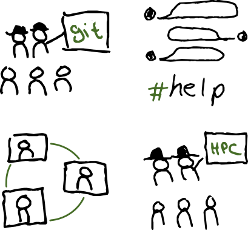

class: center, middle, gray-background

## - My gateway into Research Software Engineering

Samantha Wittke, CodeRefinery, CSC - IT Center for Science
samantha.wittke@csc.fi

RSEHPC@ISC24 ; Slides built with cicero.xyz

---

# How it all started ...

 
 

---

# But then in 2018 ...

.left-column20[

]

.left-column70[
- **Basics and collaborative version control**
- **Reproducible dependencies, environments, and computational steps**
- **Software and data licensing and software citation**
- **How to document your research software**
- **Reusable and reproducible Jupyter notebooks**
- **Automated testing**
- **Modular code development**

]

 

.center[

]

---

# Getting into it

.center[

]

---

# Community

 
 

.center[

]

---

# Connection to RSE and HPC

.center[

]

---

# Find your people

Join communities, start your own, local chapters, ... 

 
 

.center[

]

