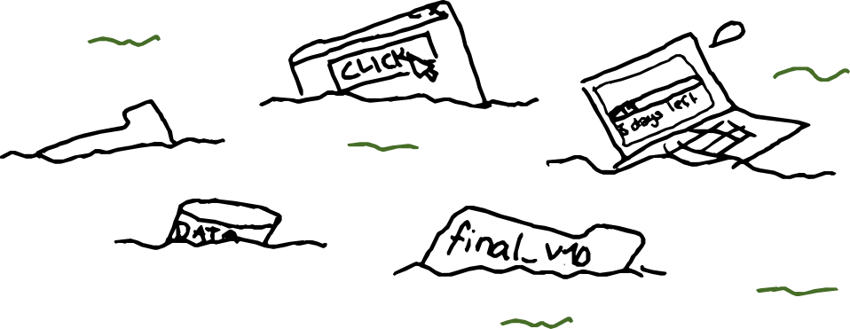

class: center, middle, gray-background

.center[
     
]

 

## Software Sustainability Institute Fellowship application '24

Samantha Wittke, CodeRefinery, CSC - IT Center for Science,
samantha.wittke@csc.fi

Slides built with cicero.xyz

---

# Who am I professionally?

 
 
.center[
     
]

.footnote[Sentinel-2 image from https://eox.at/2015/12/understanding-sentinel-2-satellite-data/]

---

# Where do I come from?

 

.center[
     
]

---

# What do I do now?

 

.center[

]

---

# Why am I applying for the fellowship

.center[

]

---

# My plan for the fellowship

 
 

1. Engage with RSE leaders and enablers

2. Identify and connect with Finnish RSEs

3. Organize an in-person Finnsish RSE meet-up

4. Promote participation in (Nordic-)RSE activities

---

 
 

# Thank you for your time and consideration!
